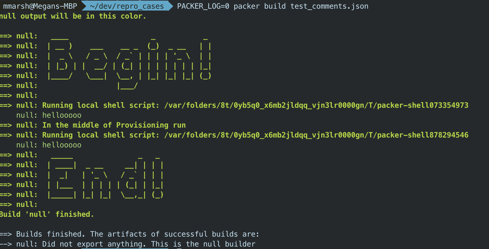

# Packer-Provisioner-Comment
This is a demonstration provisioner to help teach people how to create and use
their own Packer plugins.





## Installation

In order to install the plugin, simply clone the repo and run the following
commands:

``` bash
go mod init main
go build
mkdir ~/.packer.d/plugins
mv main ~/.packer.d/plugins/packer-provisioner-comment
```

## Use

In order to test the plugin, create the following test file
``` json

{
    "builders": [
        {
            "type": "null",
            "communicator": "none"
        }
    ],
    "provisioners": [
        {
          "type": "comment",
          "comment": "Begin",
          "ui": true,
          "fancy": true
        },
        {
          "type": "shell-local",
          "inline": ["echo \"This is a shell script\""]
        },
        {
          "type": "comment",
          "comment": "In the middle of Provisioning run",
          "ui": true
        },
        {
          "type": "shell-local",
          "inline": ["echo \"This is another shell script\""]
        },
        {
          "type": "comment",
          "comment": "this comment is invisible and won't go to the UI"
        },
        {
          "type": "comment",
          "comment": "End",
          "ui": true,
          "fancy": true
        }
    ]
}

```

## Options

There are three options for this provisioner. None are required, but there isn't
really a point to the provisioner if you don't at least set `comment`

- `comment` (string): The string you want printed to the UI or to annotate the
  Packer template

- `ui` (bool): If true, this provisioner will print your comment to the UI. If
  false, this provisioner will do nothing. Default: false

- `fancy` (bool): Only use if `ui` is `true`, if `true`, this provisoner will
  print your comment in block letters to the UI. If `false`, won't do any fancy
  formatting and the comment will just appear as a bolded statement. Default:
  `false`